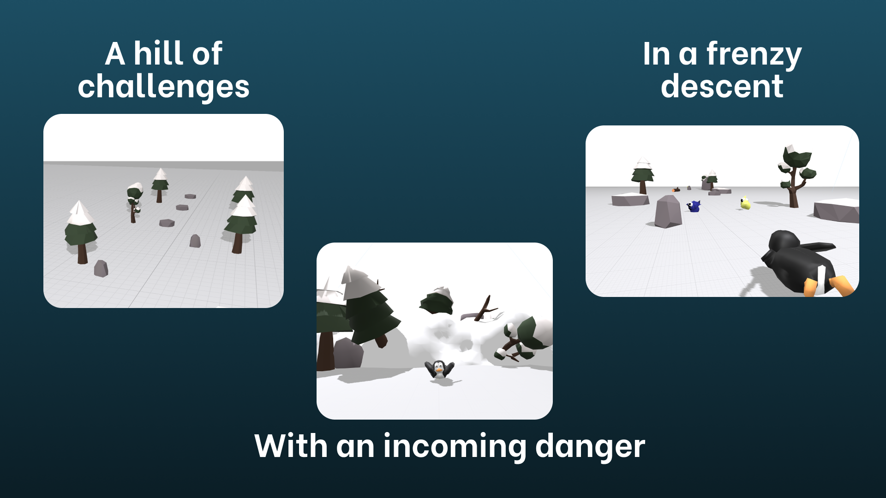

# Panic Penguin Escape From Avalanche

<p align="middle">
  
  
</p>

Panic Penguin is a 3D iOS game built using SceneKit. The player takes control of a penguin sliding down a mountain trying not to be caught by an avalanche. Available on App Store [here](https://apps.apple.com/br/app/panic-penguin-escape/id1607499398?l=en).

# The Game

Panic Penguin Escape From Avalanche is an exciting endless runner where you play as a penguin sliding down a beautiful snowy mountain.

- Beautiful 3D Landscape

- Control either by touch or motion

- Dodge obstacles such as rocks, logs and tree stumps

- Eat yellow fish to collect points

- Eat blue fish to go faster

- Do not get hit, or else the avalanche catches up to you!

- See your friends scores in the leaderboard! (GameCenter Required)

## Controls

The game let you decide between 2 control options: using **touch** or **motion**.

### Touch

Hold on either side of the screen to move the penguin in that direction.

### Motion

Tilt your phone to the sides to slide the penguin and avoid the obstacles.

# Tools

## SwiftLint

Use [SwiftLint](https://github.com/realm/SwiftLint) to write source code for this repository. Lint rules are described in `.swiftlint.yml`. To install it with `brew`, run:

```
brew install swiftlint
```

# The Project

This was the first game developed by all 5 team members during a project in the Apple Developer Academy - Campinas, Brazil. The 3D assets were built using [Blender](https://www.blender.org/) and all of the game implementation was native implemented using Apple's SceneKit.

## Members

|          |                                                  |                                                                            |
| -------- | ------------------------------------------------ | -------------------------------------------------------------------------- |
| Eduardo  | [GitHub](https://github.com/eduardodini)         | [LinkedIn](https://www.linkedin.com/in/eduardo-d-ab7583155/)               |
| Erick    | [GitHub](https://github.com/erickmanaroulas)     | [LinkedIn](https://www.linkedin.com/in/erickmana/)                         |
| Gabriel  | [GitHub](https://github.com/MuelasU)             | [LinkedIn](https://www.linkedin.com/in/gabriel-muelas/)                    |
| Leonardo | [GitHub](https://github.com/leonardosrodrigues0) | [LinkedIn](https://www.linkedin.com/in/leonardosrodrigues1/)               |
| Matheus  | [GitHub](https://github.com/MaThhiVick)          | [LinkedIn](https://www.linkedin.com/in/matheus-alencar-vicente-32977b14b/) |
